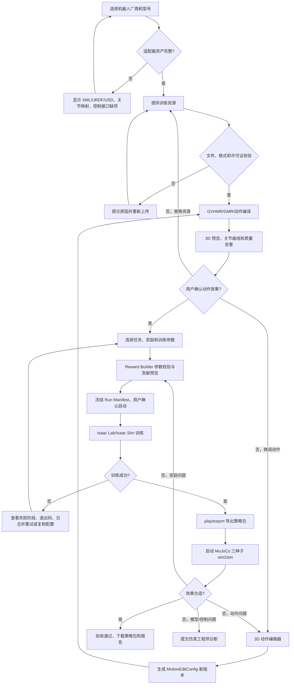

# 通用人形机器人 RL 训练平台开发 PRD

| 项目 | 内容 |
| --- | --- |
| 文档版本 | v0.4（前端原型与 MuJoCo 动作工作台实现基线） |
| 文档状态 | Prototype 已完成；生产闭环待 P0 评审 |
| 继承版本 | v0.3《通用人形机器人 RL 训练平台开发 PRD》 |
| 目标用户 | 机器人算法工程师、仿真工程师、研究员、项目导师 |
| 首个机器人 | Unitree G1 29 DoF |
| 首个训练闭环 | 训练资源 → GVHMR → GMR → 3D 动作编辑 → Motion Compiler → Isaac Lab/Isaac Sim → 策略导出 → MuJoCo sim2sim → 策略包 |
| 前端 | React + TypeScript + Vite + React Router + TanStack Query + Zustand + Three.js/React Three Fiber |
| 后端 | Python 3.11 + FastAPI + Pydantic v2 + SQLAlchemy 2 + Alembic |
| 队列与事件 | Redis 7 + Celery，开发/测试/生产统一使用 |
| 主数据库 | PostgreSQL 16，开发/测试/生产统一使用 |
| 对象存储 | S3 API 兼容的 MinIO 或云 S3；本地也通过服务运行，不以项目目录作为唯一副本 |
| 仿真基线 | Ubuntu 22.04、双 RTX 4090、Isaac Lab v2.3.0、Isaac Sim 5.1.0.0、Python 3.11 |

## 0. 本版变更摘要

本版在 v0.2 的平台定位、统一数据契约、G1 首个适配器和版本锁定原则之上，新增以下正式能力：

1. 普通用户可以在浏览器中查看 3D 机器人动作、时间轴和关节曲线。
2. 用户可以通过全局变换、关节偏移、关键帧和受约束 IK 对动作进行微调。
3. 用户可以通过 Reward Builder 调整已注册奖励项的开关、权重、阈值和阶段退火参数。
4. 动作编辑和奖励修改均产生新版本，不覆盖原始资源、Run Manifest 或训练产物。
5. sim2sim 失败后可以区分动作问题、奖励问题和模型/控制映射问题，并回到对应环节。
6. 明确前端、API、领域逻辑、作业编排、机器人适配器和基础设施的模块边界。
7. 回写本轮已经落地的 React UI、机器人选择原型、真实 G1 MuJoCo 渲染服务、动作帧编辑、关键帧、关节微调、相机交互和动作切换重置实现。
8. 明确本轮是本地可运行原型与 MuJoCo 编辑服务，不将尚未实现的 FastAPI、PostgreSQL、Redis/Celery、Isaac Lab 训练 worker 和生产对象存储标记为已完成。

本版不改变以下决策：

- Isaac Lab + Isaac Sim 是训练底座，Unitree RL Lab 只作为组织形式参考。
- Web API 不导入 Isaac Sim，不在请求线程运行训练。
- GVHMR、GMR、Isaac Lab 和 Unitree MuJoCo 使用隔离环境，通过产物和 manifest 交接。
- 普通用户不能上传任意 Python/shell，也不能直接控制真实机器人。

## 1. 产品定位与原则

### 1.1 产品定位

平台是一个面向多厂家人形机器人的训练工作流编排器、动作检查工具、奖励配置工具和 sim2sim 验收界面。平台复用现有人体估计、动作重定向、物理仿真和 RL 组件，不重新实现物理引擎或 RL 算法。

### 1.2 核心原则

- **配置可复用，权重按机器人训练**：任务描述、奖励 schema 和验收报告可以复用；策略权重不承诺跨机器人直接运行。
- **数据先于代码**：动作、奖励、机器人和运行环境都必须通过版本化契约表达。
- **用户编辑受约束**：用户可修改动作参数和注册奖励参数，不可修改机器人安全边界、任意代码或底层控制协议。
- **原始产物不可变**：编辑、转换、训练和重试都创建新版本或新 attempt。
- **后端是唯一事实源**：浏览器只负责交互和预览，最终动作编译、质量校验、训练和验收由后端 worker 执行。
- **适配器隔离差异**：机器人 XML/USD、关节映射、PD、控制周期、DDS 和厂商协议必须留在适配器边界内。

## 2. 目标与非目标

### 2.1 MVP 目标

- 用户选择已适配的机器人厂商和型号，MVP 为 Unitree G1 29 DoF。
- 用户上传视频/动作文件，或选择已有训练资源。
- 系统完成 GVHMR、GMR、动作编译和质量校验。
- 用户在 3D 窗口中预览动作，并完成有限的全局、关节、关键帧或 IK 微调。
- 用户选择任务、场景、奖励模板和训练参数，启动 Isaac Lab/Isaac Sim 训练。
- 用户实时查看阶段状态、日志、奖励分项、曲线、GPU 状态和视频。
- 训练结束后自动导出 checkpoint、JIT/ONNX、部署配置和运行元数据。
- 用户启动至少三个随机种子的 MuJoCo sim2sim 验收，查看报告并下载策略包。
- 用户可以基于上一轮作业复制配置，修改 RewardConfig 后重新训练。

### 2.2 MVP 非目标

- 不在 Web 进程直接加载 Isaac Sim 或 CUDA 仿真库。
- 不开放任意 Python 奖励代码、shell 命令或自定义执行器。
- 不让单目视频自动提供可靠的箱体 6D 位姿；箱体状态由表单或场景文件提供。
- 不在浏览器中执行权威 IK、物理仿真或策略推理；浏览器预览不能取代后端校验。
- 不执行远程实机控制；MVP 只生成带安全提示的部署包。
- 不支持所有机器人共用同一份权重，也不在没有适配器资产时自动接入新机器人。

## 3. 角色与权限

| 角色 | 主要权限 |
| --- | --- |
| 普通算法用户 | 创建项目、上传资源、选择已适配机器人和任务、编辑动作、编辑注册奖励、启动训练、查看和下载本人有权限的产物 |
| 算法工程师 | 管理奖励模板和插件 schema、调试训练配置、审阅实验对比 |
| 仿真工程师 | 注册机器人适配器、维护场景、控制映射、sim2sim 阈值和 worker 运行时 |
| 项目负责人/导师 | 查看项目内作业、批准策略包下载、查看验收报告 |
| 平台管理员 | 管理用户、项目、GPU worker、许可证、对象存储和审计日志 |

权限最小化原则：用户只能访问被授权项目及其对象；worker 只能访问当前作业工作目录；适配器、奖励插件和运行时配置不能由普通用户上传覆盖。

## 4. 普通用户业务流程



### 4.1 用户可见状态

```text
CREATED → UPLOADING → UPLOADED → GVHMR_RUNNING → GVHMR_READY
→ GMR_RUNNING → RETARGET_READY → MOTION_EDITING
→ MOTION_VALIDATING → TRAINING_PREPARING → TRAINING
→ TRAINING_SUCCEEDED → EXPORTING → SIM2SIM_RUNNING
→ SIM2SIM_PASSED/ SIM2SIM_FAILED → READY_TO_DOWNLOAD
```

任意阶段可进入 `FAILED` 或 `CANCELLED`。重试生成新的 `attempt`，原始日志和产物保留。

## 5. 功能需求

### 5.1 项目与资源

- 创建项目并维护项目成员、默认机器人、默认任务和存储配额。
- 上传视频、动作文件、场景文件和机器人相关资源；限制 MIME、扩展名、大小、时长和路径。
- 记录来源、许可证、用户声明、文件 hash、媒体信息和生命周期。
- 支持已有动作资源复用，但每次编辑和编译都产生新资源版本。

### 5.2 机器人与任务选择

机器人选择器显示：

- 厂商、型号、DoF 和关节列表；
- XML/URDF/USD/网格是否完整；
- GMR 身体映射覆盖率；
- 观测/动作维度、控制模式、控制周期和动作缩放；
- 支持的任务、场景、sim2sim 适配器和许可证状态。

适配器自检失败时禁止创建训练作业。

### 5.3 训练资源转换

系统后台执行：

1. GVHMR：视频 → `hmr4d_results.pt`。
2. GMR：人体运动 → `RetargetMotion`。
3. Motion Editor：应用用户编辑层，生成编辑后动作。
4. Motion Compiler：重采样、坐标/四元数转换、速度计算和质量校验。
5. 输出 Isaac Lab `MotionLoader` 兼容的 `TrainMotionNPZ`。

用户不需要看到底层 CLI，但必须看到阶段状态、耗时、告警、输入输出和可读错误摘要。

### 5.4 3D 动作编辑器

#### 首期能力

- 机器人模型、参考骨架、当前动作和轨迹叠加显示；
- 时间轴、播放/暂停、逐帧、循环、帧率和片段范围；
- 根位置、根高度、初始朝向和时间缩放；
- 单关节或关节组的角度偏移；
- 关键帧姿态和插值；
- 手、脚、躯干等目标的受约束 IK 调整；
- 关节曲线、关节限位、速度/加速度和脚底滑动告警；
- 应用、撤销、另存为新版本和恢复原始动作。

#### 技术边界

- 浏览器使用 Three.js/React Three Fiber 进行预览和交互。
- 浏览器不加载 Isaac Sim，不作为最终 IK 或物理结果的权威来源。
- 后端按真实 `RobotSpec`、IK 配置和坐标契约重新计算并校验。
- 用户不能修改关节顺序、DoF、控制频率、执行器力矩范围和安全终止条件。

#### `MotionEditConfig`

```json
{
  "motion_edit_version": "motion_edit.v1",
  "source_motion_id": "motion_001",
  "robot_id": "unitree_g1_29dof",
  "global_transform": {
    "translation": [0.0, 0.0, 0.03],
    "yaw_offset": 0.05,
    "time_scale": 1.0
  },
  "joint_offsets": [
    {
      "joint_name": "left_shoulder_pitch_joint",
      "frame_start": 120,
      "frame_end": 240,
      "position_offset": 0.08
    }
  ],
  "ik_targets": [
    {
      "body_name": "left_hand",
      "frame_start": 120,
      "frame_end": 240,
      "target_offset": [0.02, 0.0, 0.04]
    }
  ],
  "filters": {"smooth": true, "max_velocity_check": true}
}
```

### 5.5 Reward Builder

普通用户只能使用已注册的奖励项和参数 schema。每个奖励项必须声明：

- `id`、名称、说明、单位和来源；
- 参数类型、默认值、最小/最大值和步长；
- 权重范围和正负方向；
- 适用机器人、任务和阶段；
- 是否属于安全约束或硬终止；
- 平均贡献、标准差和占总回报比例的展示方式。

#### 可编辑内容

- 启用/停用 shaping reward；
- 权重；
- `sigma`、距离阈值、容差、接触持续时间等参数；
- 训练阶段和退火策略；
- 模板复制和版本说明。

#### 不可由普通用户关闭的约束

- NaN/Inf 检查；
- 摔倒和危险姿态终止；
- 关节硬限位；
- 最大力矩比例；
- 不可恢复碰撞；
- 基本控制周期和执行器约束。

#### `RewardConfig`

```json
{
  "reward_version": "reward.v2",
  "base_template": "g1_mimic_v1",
  "terms": [
    {
      "id": "tracking.anchor_pos",
      "enabled": true,
      "weight": 1.2,
      "params": {"sigma": 0.25}
    },
    {
      "id": "regularization.action_rate",
      "enabled": true,
      "weight": -0.02,
      "params": {}
    },
    {
      "id": "task.box_hand_pose",
      "enabled": true,
      "weight": 2.0,
      "params": {"distance_threshold": 0.08}
    }
  ],
  "terminations": ["timeout", "bad_anchor_orientation", "fall"]
}
```

RewardConfig 修改必须产生新版本，并保留 `parent_run_id`。如果改变观测维度、动作维度、任务语义或机器人型号，默认从头训练；轻微权重调整才允许选择从 checkpoint 继续。

### 5.6 训练与监控

- 训练请求只创建异步作业，不同步等待。
- Worker 记录命令数组、工作目录、GPU、环境摘要、版本、退出码和 stdout/stderr。
- 前端通过 SSE 订阅状态、日志和指标；断线后从服务端按游标恢复。
- 展示总回报、奖励分项、episode 长度、跌倒率、动作饱和率、GPU/显存和训练视频。
- 支持取消、失败重试、断点恢复（由后端适配器声明是否支持）。

### 5.7 sim2sim 验收

- 至少运行 3 个随机种子。
- 报告 NaN、进程崩溃、穿模、跌倒、根高度、姿态、漂移、动作跟踪误差和饱和率。
- 箱体任务额外报告目标误差、手/箱相对位姿、箱体高度、脱落次数、接触异常和成功率。
- 保存 Isaac 与 MuJoCo 关键曲线、视频、阈值、版本和模型 hash。
- 失败分类：动作/重定向、奖励/训练、模型/控制映射、运行时资源。

### 5.8 策略包

```text
policy.pt
policy.onnx
params/deploy.yaml
params/env.yaml
params/agent.yaml
export_meta.json
sim2sim_report.json
videos/
checksums.sha256
```

策略包不代表真实机器人安全可用。下载页必须显示许可证、适配器版本、控制周期、人工复核和安全提示。

## 6. 总体技术架构

```text
React SPA
  ├─ REST API / SSE
  ▼
FastAPI API
  ├─ Auth / Project / Asset / Job / Reward / Artifact API
  ├─ Application Services
  ├─ Domain Contracts and Policies
  └─ PostgreSQL / Redis / Object Storage
          │
          ▼
Job Dispatcher
  ├─ Motion Worker: GVHMR / GMR / Motion Compiler / Motion Editor
  ├─ Isaac Worker: Isaac Lab / Isaac Sim train/play/export
  └─ Sim2Sim Worker: MuJoCo or Vendor Simulator Adapter
          │
          ▼
Versioned Run Workspace
```

### 6.1 前端构建框架

| 层 | 技术与职责 |
| --- | --- |
| 构建 | Vite、TypeScript、ES2022 |
| 路由 | React Router |
| 服务端状态 | TanStack Query，负责缓存、请求、失效和重试 |
| 向导临时状态 | Zustand；刷新后不作为事实源 |
| 表单校验 | React Hook Form + Zod |
| 3D | Three.js + React Three Fiber + drei |
| 图表 | Recharts 或 ECharts |
| 样式 | 项目统一设计 token；组件库可选 shadcn/ui |
| 测试 | Vitest、React Testing Library、Playwright |

前端按功能切片组织，不按“所有组件/所有页面”堆放业务逻辑：

```text
frontend/src/
  app/                  # 路由、QueryClient、全局错误边界
  features/
    projects/
    assets/
    robot-selection/
    motion-editor/
    reward-builder/
    training-monitor/
    sim2sim/
    artifacts/
  entities/              # 项目、作业、资源、机器人、奖励等 DTO 类型
  shared/
    api/                 # HTTP/SSE 客户端
    ui/                  # 无业务组件
    validation/          # Zod schema
    lib/                 # 格式化、权限和时间工具
```

页面组件只负责组合；请求、表单规则、3D 编辑状态和业务转换放在 feature 内部。组件不能直接调用 `fetch` 或拼接后端路径。

### 6.2 后端构建框架

采用轻量 Clean Architecture / Hexagonal Architecture：

```text
backend/
  app/
    api/                 # FastAPI routers、DTO、依赖注入
    application/         # 用例编排和事务边界
    domain/              # 实体、值对象、状态机、策略和端口
    adapters/            # Isaac/GMR/GVHMR/MuJoCo/机器人适配器实现
    infrastructure/      # SQLAlchemy、Redis、对象存储、进程执行器
    workers/             # Celery task 和阶段 runner
    config/              # 环境变量、版本和路径配置
  tests/
    unit/
    integration/
    contract/
```

依赖方向必须保持：

```text
api → application → domain
adapters/infrastructure → domain ports
workers → application
```

领域层不能导入 FastAPI、SQLAlchemy、Celery、Isaac Sim 或具体机器人 SDK。具体执行器通过协议/端口注入。

### 6.3 Worker 设计

所有长任务采用阶段 runner：

```text
validate → prepare_workspace → execute → collect_logs
→ validate_outputs → register_artifacts → publish_event
```

每个 runner 必须：

- 输入和输出契约明确；
- 支持幂等检查；
- 使用参数数组而不是 shell 字符串；
- 使用独立工作目录；
- 捕获退出码、日志、GPU 和版本摘要；
- 返回结构化错误码；
- 不覆盖已有 attempt。

## 7. 模块化设计

### 7.1 领域模块

| 模块 | 核心职责 | 不负责 |
| --- | --- | --- |
| Project | 项目、成员和权限 | 文件内容处理 |
| Asset | 资源元数据、hash、许可证和版本 | 具体 GVHMR/GMR 执行 |
| Robot | RobotSpec、适配器发现和能力校验 | 训练算法 |
| Motion | RetargetMotion、MotionEditConfig、TrainMotionNPZ 校验 | Web 页面渲染 |
| Reward | RewardTermSpec、RewardConfig、范围和硬约束 | 直接执行 Python 奖励代码 |
| Job | 作业状态机、attempt、取消和重试策略 | 具体仿真命令 |
| Training | train/play/export 用例和 manifest | 数据库 SQL |
| Sim2Sim | 验收场景、指标、阈值和报告 | 机器人控制 SDK 细节 |
| Artifact | 产物索引、下载权限和校验和 | 产物内部生成 |
| Audit | 审计事件和变更记录 | 业务状态决定 |

### 7.2 适配器接口

```python
class BackendAdapter(Protocol):
    def list_tasks(self) -> list[TaskDescriptor]: ...
    def validate_config(self, manifest: RunManifest) -> ValidationResult: ...
    def train(self, manifest: RunManifest, output_dir: Path) -> ExecutionResult: ...
    def play(self, checkpoint: Path, manifest: RunManifest, output_dir: Path) -> ExecutionResult: ...
    def export(self, checkpoint: Path, manifest: RunManifest, output_dir: Path) -> ExecutionResult: ...
    def sim2sim(self, bundle: Path, manifest: RunManifest, output_dir: Path) -> ExecutionResult: ...
```

机器人适配器另行提供：

- RobotSpec；
- GMR 身体映射和 IK 配置；
- Isaac Lab task 映射；
- MuJoCo/厂商 sim2sim 运行器；
- 部署配置 schema；
- 版本和许可证元数据。

### 7.3 高内聚低耦合规则

- 一个模块只拥有一类业务不变量；跨模块通过命令、DTO、事件或端口通信。
- 数据库模型不能直接作为 API 响应模型；使用 domain model 和 DTO 转换。
- 具体命令、路径和环境变量只能在 adapter/infrastructure 层出现。
- 前端 feature 不能依赖另一个 feature 的内部文件；共享内容进入 `entities` 或 `shared`。
- 不在单个 service 中同时实现上传、训练、导出和验收；每个阶段可独立测试和重试。
- 新增机器人不能修改通用训练流程，只能新增适配器、RobotSpec、任务注册和测试。
- 新增奖励必须实现注册项、参数 schema、说明、范围和单元测试。

## 8. 数据契约与处理

### 8.1 `RobotSpec`

```json
{
  "robot_id": "unitree_g1_29dof",
  "vendor": "Unitree",
  "model_version": "g1_29dof",
  "assets": {"mujoco_xml": "...", "urdf": "...", "usd": "..."},
  "joint_names": ["..."],
  "body_names": ["pelvis", "torso_link"],
  "actuation": {"mode": "position", "control_dt": 0.02},
  "limits": {"position": "...", "velocity": "...", "torque": "..."},
  "action_scale": "...",
  "deploy_adapter": "unitree_g1_29dof",
  "capabilities": ["mimic", "velocity", "box_reach"]
}
```

### 8.2 `RetargetMotion`

```json
{
  "format_version": "retarget_motion.v1",
  "robot_id": "unitree_g1_29dof",
  "fps": 30,
  "root_pos": "float32[N,3]",
  "root_rot": "float32[N,4]",
  "root_rot_convention": "xyzw",
  "dof_pos": "float32[N,29]",
  "joint_names": ["..."],
  "coord_frame": "world_z_up",
  "source": {"type": "gvhmr", "asset_id": "..."},
  "quality": {"nan_count": 0, "joint_limit_violation_ratio": 0.0}
}
```

### 8.3 `TrainMotionNPZ`

必须兼容 MotionLoader，至少包含：

```text
fps
joint_pos
joint_vel
body_pos_w
body_quat_w
body_lin_vel_w
body_ang_vel_w
```

编译器必须验证：shape、有限值、四元数归一化、身体名称覆盖率、关节顺序、帧率插值、关节位置/速度/加速度限值和地面高度。

### 8.4 `RunManifest`

Run Manifest 在用户确认启动后冻结，至少记录：

- `project_id`、`run_id`、`attempt_id`、`parent_run_id`；
- `robot_id`、`task_id`、`scene_id`、`motion_asset_id`；
- `motion_edit_config_id`、`reward_config_id`、`training_config`；
- 所有输入资产 hash；
- 代码仓库 URL、Git SHA、包版本和容器 digest；
- Python、CUDA、驱动、Isaac、MuJoCo 和 worker 信息；
- 随机种子、GPU、num_envs、最大迭代、恢复 checkpoint；
- 许可证快照和配置 schema 版本。

### 8.5 数据处理和质量门禁

```text
上传校验
  → 病毒/路径/MIME/大小检查
  → 许可证登记和 SHA-256
  → GVHMR 输出 schema 检查
  → GMR 坐标/四元数/关节顺序检查
  → 3D 动作编辑层应用
  → Motion Compiler 生成 NPZ
  → 关节/速度/接触/地面质量检查
  → 训练配置和奖励 schema 检查
  → 冻结 Run Manifest
```

所有转换都必须记录 `source_id`、转换器版本、输入 hash、输出 hash、参数和时间。失败不得生成可训练状态。

## 9. 数据库设计与选型

### 9.1 选型

- **PostgreSQL 16**：唯一业务事实源，负责用户、项目、权限、资源版本、作业状态、Run Manifest、指标索引、产物元数据和审计事务。开发、测试和生产统一使用 PostgreSQL，不再引入 SQLite 作为替代数据库。
- **Redis 7**：任务队列 broker、短期缓存、分布式锁、worker 心跳、限流计数和实时事件流；不保存唯一业务事实。开发、测试和生产统一使用 Redis 兼容服务。
- **对象存储**：使用 S3 API 兼容的 MinIO 或云 S3 保存视频、动作文件、NPZ、checkpoint、日志归档、预览视频和验收报告。对象存储是文件存储层，不引入第二套业务数据库。

生产数据库层固定为 **PostgreSQL + Redis**；本地开发也通过 Docker/本地服务运行同一组合。对象存储只负责大文件字节流，所有对象必须在 PostgreSQL 中登记元数据、URI、版本、hash、大小、权限和生命周期。

不把视频、NPZ、checkpoint 或完整日志正文写入 PostgreSQL，也不把大文件写入 Redis。小型配置和 schema 可以存入 PostgreSQL `jsonb`；Redis 只缓存可重建数据和队列状态。

### 9.1.1 存储分层

```text
PostgreSQL：业务元数据、状态、权限、版本、索引、审计、指标摘要
Redis：队列、缓存、锁、心跳、限流、事件流
对象存储：视频、动作、模型、checkpoint、日志归档、报告
Worker 本地盘：当前 attempt 的临时解压、转换和运行文件
```

Worker 本地盘中的文件只能作为临时工作副本。阶段完成后上传对象存储并写入 PostgreSQL；作业清理时删除临时目录，不删除仍被引用的对象。

### 9.2 核心实体关系

```text
User ─< ProjectMember >─ Project ─< Run ─< Attempt
Project ─< Asset ─< AssetVersion
Run ─1 RunManifest
Run ─< MetricPoint
Attempt ─< LogEvent
Run ─< Artifact
RobotAdapter ─< RobotVersion
TaskTemplate ─< RewardTemplate ─< RewardConfig
Run ─1 MotionEditConfig
Run ─< Sim2SimEvaluation ─< EvaluationSeed
```

### 9.3 主要表

| 表 | 关键字段 | 说明 |
| --- | --- | --- |
| `users` | `id`, `email`, `status` | 用户身份 |
| `projects` | `id`, `name`, `owner_id`, `status` | 项目 |
| `project_members` | `project_id`, `user_id`, `role` | 项目权限 |
| `assets` | `id`, `project_id`, `kind`, `license_status` | 逻辑资源 |
| `asset_versions` | `id`, `asset_id`, `uri`, `sha256`, `manifest_json` | 不可变资源版本 |
| `robot_adapters` | `id`, `vendor`, `robot_id`, `status` | 适配器身份 |
| `robot_versions` | `id`, `adapter_id`, `git_sha`, `spec_json` | RobotSpec 和资产版本 |
| `task_templates` | `id`, `task_id`, `schema_version`, `spec_json` | 任务模板 |
| `reward_templates` | `id`, `task_id`, `version`, `schema_json` | 奖励项注册和参数 schema |
| `reward_configs` | `id`, `template_id`, `version`, `config_json`, `created_by` | 用户可复制的配置 |
| `motion_edits` | `id`, `source_asset_version_id`, `config_json`, `output_asset_version_id` | 动作编辑层 |
| `runs` | `id`, `project_id`, `status`, `parent_run_id`, `created_by` | 逻辑作业 |
| `attempts` | `id`, `run_id`, `number`, `status`, `started_at`, `exit_code` | 可重试执行 |
| `run_manifests` | `run_id`, `attempt_id`, `manifest_json`, `manifest_sha256` | 冻结运行契约 |
| `metric_points` | `attempt_id`, `step`, `name`, `value`, `timestamp` | 训练指标 |
| `log_events` | `attempt_id`, `seq`, `level`, `stage`, `message`, `payload_json` | 结构化日志 |
| `artifacts` | `run_id`, `kind`, `uri`, `sha256`, `size_bytes` | 产物索引 |
| `sim2sim_evaluations` | `run_id`, `adapter_id`, `status`, `thresholds_json` | 验收批次 |
| `evaluation_seeds` | `evaluation_id`, `seed`, `metrics_json`, `video_artifact_id` | 单个随机种子结果 |
| `audit_events` | `project_id`, `actor_id`, `action`, `resource_type`, `resource_id`, `payload_json` | 审计 |

### 9.4 数据库约束和索引

- 所有表使用 UUID 或 UUIDv7 主键；业务状态使用受限枚举。
- `asset_versions.sha256`、`run_manifests.manifest_sha256`、`artifacts.sha256` 建唯一索引。
- `runs(project_id, created_at desc)`、`attempts(run_id, number)`、`log_events(attempt_id, seq)` 建组合索引。
- `metric_points(attempt_id, name, step)` 建查询索引；高频指标按月或项目规模决定分区。
- 状态迁移在事务中写入状态和审计事件；禁止直接修改历史 manifest。
- 所有写接口使用幂等键，避免网络重试重复创建作业或产物。

### 9.5 视频和训练大对象存储

#### 9.5.1 对象 key 设计

对象 key 不使用用户原始文件名作为唯一标识，统一采用不可猜测的项目和资源版本路径：

```text
projects/{project_id}/assets/{asset_id}/versions/{asset_version_id}/source/{random_name}
projects/{project_id}/assets/{asset_id}/versions/{asset_version_id}/derived/{kind}/{random_name}
projects/{project_id}/runs/{run_id}/attempts/{attempt_id}/artifacts/{kind}/{random_name}
```

对象 key 中不放用户输入的路径分隔符；原始文件名仅作为数据库展示字段保存。

#### 9.5.2 上传流程

```text
创建上传会话
  → API 在 PostgreSQL 创建 asset_version = UPLOADING
  → API 返回短时效 presigned URL 或 multipart upload 参数
  → 浏览器分片并发上传到对象存储
  → 浏览器提交 complete
  → Worker 校验 MIME、大小、视频时长、hash 和许可证
  → PostgreSQL 原子更新为 UPLOADED 或 REJECTED
```

要求：

- 视频使用 multipart/resumable upload；大于 100 MB 时默认分片。
- 上传分片数量和并发度受项目级限额控制，避免单用户占满带宽。
- 服务端重新计算 SHA-256，不信任浏览器传入的 hash。
- 上传完成前对象不可被训练 worker 使用；状态必须是 `UPLOADED`。
- 同一项目内按 SHA-256 做去重引用，但不同逻辑资源仍可拥有不同说明和许可证记录。
- 预览视频、缩略图和低帧率动作轨迹作为 derived object 保存，不覆盖原始文件。

#### 9.5.3 生命周期与可靠性

- 原始视频默认长期保留，临时转换文件按 7～30 天生命周期清理；具体期限由项目策略决定。
- checkpoint、策略包和 sim2sim 报告在被作业或项目引用时禁止自动删除。
- 对象存储启用版本控制、服务端加密和跨磁盘冗余；生产环境不使用单盘本地目录作为唯一副本。
- PostgreSQL 只保存对象引用和 hash；下载时先检查权限，再生成短时效 presigned GET URL。
- 删除采用软删除：先标记数据库记录，后台 GC 只清理没有活动引用且超过保留期的对象。

#### 9.5.4 访问与并发

- 上传和下载走对象存储直连，API 不中转视频字节流，降低 API 内存和带宽压力。
- 预览接口只返回低分辨率视频 URI、抽样帧和压缩后的动作轨迹；不把完整 NPZ 注入浏览器。
- 同一对象的转换任务使用 `asset_version_id + processor_version + config_hash` 作为幂等键。
- 对象下载失败支持断点重试；worker 处理大对象时采用流式下载和本地临时文件。

### 9.6 任务队列与并发设计

任务队列采用 **Celery + Redis**。Redis 只负责传递任务和短期运行状态，任务最终状态仍写入 PostgreSQL。

#### 9.6.1 队列划分

```text
asset-io       上传后校验、转码、缩略图、hash
motion-cpu     GMR、Motion Editor、Motion Compiler
gvhmr-gpu      GVHMR 推理
isaac-gpu      Isaac Lab/Isaac Sim train、play、export
sim2sim-gpu    MuJoCo/厂商 sim2sim 验收
report-cpu     报告、曲线、校验和和归档
maintenance    GC、重试清理、心跳检查和指标压缩
```

队列按资源类型和 GPU 能力隔离，禁止 GPU 训练任务与普通 CPU 任务共用无界队列。

#### 9.6.2 作业投递一致性

采用 PostgreSQL outbox：

1. API 在同一事务中写入 `runs`、`attempts`、任务状态和 `outbox_events`。
2. Outbox dispatcher 读取未发布事件并投递到 Redis/Celery。
3. 投递成功后标记 outbox 事件；失败由 dispatcher 重试。
4. Worker 领取任务后使用幂等键更新 attempt，重复投递不得重复执行同一阶段。

这样可以避免“数据库已创建作业但 Redis 投递失败”或“任务已执行但 API 没有状态记录”。

#### 9.6.3 并发、限流和背压

- API 服务无状态，可水平扩展；上传和下载不占用 API worker 长连接。
- 每个 GPU worker 使用明确的 `concurrency=1` 或适配器声明的并发度，避免多个 Isaac Sim 进程争抢显存。
- 每张 GPU 使用 Redis 分布式锁或 GPU lease；锁带 TTL、心跳和异常释放机制。
- 每个项目设置并发作业数、每日 GPU 时长、上传带宽和存储配额。
- 队列设置最大长度、优先级和拒绝策略；达到上限时 API 返回可读的 `QUEUE_CAPACITY_EXCEEDED`。
- 普通 CPU 阶段可横向增加 worker；GVHMR、Isaac 和 sim2sim 以 GPU 数量为并发上限。
- 训练指标使用批量写入，日志使用序列号和缓冲 flush，避免每行日志都产生 PostgreSQL 事务。
- Redis 事件流设置保留长度；历史日志和指标以 PostgreSQL/对象存储为准，不依赖 Redis 永久保存。

#### 9.6.4 超时、重试和死信

- 每个阶段定义连接超时、执行超时、空闲超时和最大重试次数。
- 网络下载、对象存储和报告生成可以指数退避重试；确定性配置错误不自动重试。
- GPU OOM、Isaac Sim 崩溃、进程被杀和 worker 失联进入可诊断失败码。
- 超过重试次数的任务进入死信队列，并在 PostgreSQL 标记为 `FAILED_NEEDS_REVIEW`。
- worker 通过心跳更新 `attempts.last_heartbeat_at`；调度器回收超时 lease，但不覆盖已有产物。

### 9.7 高并发部署基线

初始生产部署建议：

```text
2 个 API 实例
2 个 CPU worker
1 个 motion worker
每张 GPU 1 个 Isaac/GVHMR/sim2sim worker lease
PostgreSQL primary + 定期备份
Redis 主从或 Sentinel
MinIO 分布式模式或云 S3
```

扩容顺序：先增加 API/CPU worker，再增加对象存储吞吐，最后按 GPU 数量增加 GPU worker。PostgreSQL 读压力增大时增加只读副本；业务写入和状态迁移仍只进入 primary。

## 10. API 设计

API 前缀为 `/api/v1`，响应统一包含 `request_id`、`resource_version` 和结构化错误。

| 方法 | 路径 | 说明 |
| --- | --- | --- |
| POST | `/projects` | 创建项目 |
| GET | `/projects/{id}` | 项目概览 |
| POST | `/projects/{id}/assets` | 创建上传会话 |
| POST | `/assets/{id}/upload-url` | 获取单分片或 multipart presigned URL |
| POST | `/assets/{id}/upload-complete` | 提交分片完成并进入校验队列 |
| POST | `/assets/{id}/versions/complete` | 完成上传并登记 hash |
| GET | `/robots` | 查询适配器、能力和许可证 |
| GET | `/tasks` | 查询任务模板 |
| POST | `/motions/{id}/retarget` | 创建 GVHMR/GMR 转换作业 |
| GET | `/motions/{id}/preview` | 获取动作预览数据和质量告警 |
| POST | `/motion-edits` | 创建 MotionEditConfig 版本 |
| POST | `/motion-edits/{id}/compile` | 应用编辑并生成 TrainMotionNPZ |
| GET | `/reward-templates` | 查询奖励项 schema |
| POST | `/reward-configs` | 创建 RewardConfig 版本 |
| POST | `/runs` | 校验配置、冻结 manifest 并创建作业 |
| GET | `/runs/{id}` | 查询状态和摘要 |
| GET | `/runs/{id}/events` | SSE 日志和指标流 |
| POST | `/runs/{id}/cancel` | 取消当前 attempt |
| POST | `/runs/{id}/retry` | 创建新的 attempt |
| POST | `/runs/{id}/export` | 启动策略导出 |
| POST | `/runs/{id}/sim2sim` | 启动验收批次 |
| GET | `/runs/{id}/comparison` | 对比父作业和当前作业 |
| GET | `/artifacts/{id}` | 产物元数据和下载地址 |

`/upload-complete` 只表示对象存储 multipart 已结束；`/versions/complete` 由校验 worker 在 MIME、时长、SHA-256 和许可证检查完成后调用，不能由浏览器直接把资源标记为可训练。

长任务接口只创建作业。下载接口必须执行项目权限检查、产物 hash 校验和许可证提示。

## 11. 运行隔离与部署

```text
浏览器/前端容器
        │
API 容器（不加载 Isaac Sim）
        │
PostgreSQL（事实源） + Redis（队列/缓存/锁/事件） + S3/MinIO（大对象）
        │
Celery Dispatcher / Outbox
        │
分队列 Worker
        ├─ GMR 环境
        ├─ GVHMR 环境
        ├─ Isaac Lab/Isaac Sim 环境
        └─ MuJoCo/厂商 sim2sim 环境
```

### 11.1 环境边界

| 环境 | 主要组件 | 关键约束 |
| --- | --- | --- |
| 平台开发 | FastAPI、schema、任务编排 | Windows 可开发，Python 3.11 |
| GVHMR | GVHMR、Torch 2.3.0+cu121、PyTorch3D | Linux GPU、Python 3.10，独立环境 |
| GMR | GMR、Mink、MuJoCo、SMPL-X | 建议 Linux、Python 3.10；MuJoCo 版本需单独锁定 |
| Isaac | Isaac Lab 2.3.0、Isaac Sim 5.1.0.0、Unitree RL Lab | Ubuntu 22.04、Python 3.11、Torch 2.7/cu128 |
| sim2sim | Unitree MuJoCo、SDK2、MuJoCo | C++ 运行时和 Python 运行时分离 |

运行目录：`runs/<project_id>/<run_id>/<attempt_id>/`。子进程使用参数数组、白名单路径和显式环境变量；禁止拼接用户输入执行 shell。API、dispatcher 和 worker 均无状态，唯一状态通过 PostgreSQL 读取；Redis 断开时不丢失已提交业务状态，恢复后由 outbox 继续投递。

## 12. 代码规范与工程质量

### 12.1 通用规则

- 使用 UTF-8、LF 和明确编码声明；新代码默认 ASCII 标识符。
- 遵循单一职责、依赖倒置、显式数据流和不可变配置原则。
- 公共接口必须有类型定义、错误码和版本字段。
- 不提交模型权重、视频、checkpoint、构建产物、密钥和本地环境目录。
- 所有外部版本写入 lockfile 或 manifest；禁止依赖浮动 `main` 作为运行身份。

### 12.2 TypeScript/React

- `strict: true`，禁止隐式 `any`。
- ESLint + Prettier + import/order；提交前执行 typecheck、lint、unit test。
- API 类型由 OpenAPI 生成或与 Pydantic schema 通过 contract test 对齐。
- 页面组件不包含复杂业务规则；feature service 负责查询、mutation 和状态转换。
- 3D 编辑器状态与训练作业状态分离；编辑状态提交前不写入服务器事实源。
- 所有异步状态有 loading、empty、error、retry 和权限拒绝状态。

### 12.3 Python

- Python 3.11 平台代码使用 Ruff、Black、Mypy/Pyright、Pytest。
- FastAPI DTO 使用 Pydantic v2；数据库模型使用 SQLAlchemy 2 typed mapping。
- 禁止在 domain 层导入 FastAPI、Celery、SQLAlchemy 和具体仿真 SDK。
- 外部命令使用 `subprocess` 参数数组，禁止 `shell=True` 和字符串拼接。
- 所有 worker 任务必须可重试、可取消、可观察；异常转换为稳定错误码。
- 关键数据契约使用 JSON Schema/contract test；运动数组使用 shape、dtype、finite-value 测试。

### 12.4 Git 与评审

- Conventional Commits：`feat`、`fix`、`docs`、`test`、`refactor`、`chore`。
- 分支按功能或修复划分；禁止直接在 `main` 上提交未评审的运行时改动。
- Pull Request 必须说明影响模块、迁移、配置变化、测试命令和回滚方式。
- 适配器、奖励插件和数据契约变更必须有至少一项 contract/integration test。

## 13. 测试与验收

### 13.1 单元测试

- 四元数 `xyzw/wxyz` 转换和归一化；
- RobotSpec 关节顺序、DoF 和能力校验；
- MotionEditConfig 应用、插值、限位和速度校验；
- RewardConfig 参数范围、硬约束和版本复制；
- 状态机迁移、重试和取消；
- Run Manifest hash 和不可变性。

### 13.2 集成测试

- 上传 → 资源版本 → 动作转换 → 预览数据；
- 3D 编辑 → Motion Compiler → TrainMotionNPZ；
- RewardConfig → Run Manifest → worker 参数；
- 训练日志/指标 → SSE 恢复；
- 导出产物 hash、部署 schema 和下载权限。

### 13.3 P0 系统验收

- 固定 `IsaacLab v2.3.0 + IsaacSim 5.1.0.0` 完成空场景、G1 mimic、play/export smoke test。
- G1 29 DoF 动作契约测试通过，包含关节顺序、四元数、帧率和 NPZ shape。
- 3D 编辑后动作可重放，质量告警和限位阻断生效。
- Reward Builder 只暴露注册项，修改后产生新的 RewardConfig 和 Run Manifest。
- 失败作业能定位阶段、命令和退出码；重试不覆盖原始 attempt。
- sim2sim 至少 3 个随机种子，报告视频、曲线、阈值和失败诊断。

### 13.4 发布验收

- `policy.pt`、`policy.onnx`、`deploy.yaml`、env/agent 配置、报告和校验和完整。
- 生产部署中 API 不加载 Isaac Sim；训练只能由授权 worker 执行。
- 多用户权限、GPU 配额、OOM、超时、取消和磁盘清理测试通过。
- 许可证、模型来源、数据来源和 overlay 状态可在 manifest 和下载页追溯。

## 14. 迭代计划

### P0：契约、环境和只读闭环（1～2 周）

- 固化 RobotSpec、RetargetMotion、TrainMotionNPZ、RewardConfig、RunManifest。
- 建立平台开发环境和 Linux GPU 环境边界。
- 完成 G1 GMR/动作编译/Isaac Lab smoke test。
- 完成 3D 只读预览、关节曲线和质量告警。

### P1：编辑与奖励配置（2～3 周）

- 全局变换、关节偏移、关键帧、简单 IK 和 MotionEditConfig。
- Reward Builder 模板、参数 schema、贡献预览和版本链。
- 动作编辑和奖励配置的 contract/integration test。

### P2：后端闭环（2～3 周）

- FastAPI、PostgreSQL、Redis、对象存储、Celery worker 和 SSE。
- 作业状态机、重试、取消、产物索引和审计。

### P3：训练验收工作台（3～4 周）

- Isaac Lab 训练监控、play/export、MuJoCo 三种子 sim2sim、报告和下载包。
- ReachBox/HugBox 分阶段任务及失败分类。

### P4：第二机器人适配器（另行评估）

- 选择公开模型、控制接口和 sim2sim 规则完整的机器人。
- 不修改通用前后端流程，只新增适配器和契约测试。

## 15. 当前风险与待决策项

1. GVHMR 许可证目前偏向教育、研究和非营利用途；商业版本需要授权或可替换人体估计后端。
2. 当前 GMR/Mink 与项目文档中的 MuJoCo 3.3.6 需要兼容性测试，不能直接假定当前源码版本可用。
3. Isaac Sim 本地源码版本与服务器 pip 运行包必须分别登记，不能将源码 `VERSION` 视为运行时身份。
4. `unitree_mujoco` 本地 overlay 必须形成独立 commit 或变更清单。
5. 箱体状态由表单/场景文件提供，暂不承诺从单目视频恢复物体 6D 位姿。
6. 需要确定生产对象存储是 MinIO 还是云 S3，以及 GPU worker 的部署位置和配额。
7. 需要确定 sim2sim 阈值由任务模板提供还是项目级覆盖；安全终止阈值不能被普通用户关闭。

## 16. 版本基线

```json
{
  "isaac_lab_git": "v2.3.0@3c6e67bb5",
  "isaac_lab_package": "0.47.2",
  "isaac_sim_package": "5.1.0.0",
  "unitree_rl_lab_package": "0.2.1",
  "unitree_rl_lab_git": "<server_sha_required>",
  "unitree_mujoco_git": "ae6a840",
  "unitree_mujoco_overlay": "<project_overlay_sha_required>",
  "mujoco_runtime": "3.3.6 (Unitree sim2sim baseline)",
  "mujoco_web_runtime": "3.12.0 (local Python off-screen renderer)",
  "mujoco_source_version": "3.12.1 (third_party/mujoco-main source baseline)",
  "gmr_git": "bb1bbe4",
  "gvhmr_git": "6ec3ca3",
  "platform_python": "3.11",
  "isaac_python": "3.11",
  "gvhmr_python": "3.10",
  "isaac_torch": "2.7.0+cu128",
  "gvhmr_torch": "2.3.0+cu121"
}
```

最终通用范式：

```text
统一数据契约
  + 3D 动作编辑器
  + 版本化 Reward Builder
  + 机器人适配器
  + Isaac Lab/Isaac Sim 训练运行时
  + Unitree/厂商 sim2sim 适配器
  + PostgreSQL/对象存储/作业事件系统
  + 版本与产物 manifest
```

## 17. 本轮实现完成情况（2026-08-24）

本节是 v0.4 的实现回写，描述当前仓库中已经可以运行和验证的内容。它与前文的生产架构规划分开记录：**已完成**表示在本地 `frontend-prototype` 中有实际代码和可复现验证；**未完成**表示仍需接入正式后端、GPU worker 或生产基础设施。

### 17.1 已落地文件与职责

| 文件/目录 | 已实现职责 | 状态 |
| --- | --- | --- |
| `frontend-prototype/react-app/src/main.jsx` | React 动作工作台、资产列表、动作时间轴、真实 MuJoCo PNG 视图、关节编辑、关键帧、导入和导出交互 | 已完成 |
| `frontend-prototype/react-app/src/styles.css` | 银色/白色设计 token、三栏工作台、响应式布局、视图拖拽/抓取状态和控件样式 | 已完成 |
| `frontend-prototype/react-app/vite.config.js` | Vite 开发服务、`/api` 到 MuJoCo 服务的本地代理 | 已完成 |
| `frontend-prototype/mujoco_service.py` | G1 MJCF/URDF 加载、动作资产发现、qpos 帧服务、关节覆盖、关键帧、导出、真实离屏渲染 | 已完成 |
| `frontend-prototype/robot-selector.html` | 机器人厂家、型号、训练源素材和 URDF 选择的浅色产品原型 | 已完成（原型） |
| `frontend-prototype/robot-selector-dark.html` | 黑色沉浸式机器人选择页，厂家和型号横向选择、中心高亮、左右暗化、机器人图片和 logo | 已完成（原型） |
| `frontend-prototype/index.html` | 动作工作台和配置向导的独立 HTML/Three.js 视觉原型 | 已完成（视觉原型） |
| `frontend-prototype/requirements-mujoco.txt` | 本地 Python MuJoCo Renderer 运行依赖 | 已完成 |
| `frontend-prototype/start_motion_lab.ps1` | Windows 本地启动 MuJoCo 服务与 React 开发服务 | 已完成 |

`.runtime/g1_mocap_29dof` 是服务启动时生成的运行时模型缓存，不是第三方源文件的替代品，也不能作为新的模型版本提交。缓存只为 Windows 下部分二进制 STL 的解析兼容性修改头部标记，网格三角形数据保持不变。

### 17.2 前端 UI 与美术设计完成情况

#### 设计基调

- 主工作台采用银色、白色和浅灰色表面，深色只用于导航轨道、主要操作和状态对比；不使用传统后台系统的大面积表格和统计卡片布局。
- 内容中心是动作和机器人本身，页面采用“动作源 / 真实 3D 视图 / 姿态检查”三栏布局，适合普通用户反复浏览、播放和微调。
- 交互控件使用图标按钮、滑块、分段选择、下拉菜单、标签和状态提示；危险或不可逆操作保留明确的文字动作按钮。
- 视图在窄屏下折叠为“编辑器 → 动作源 → 检查器”顺序，保留播放、关节和导出主流程。

#### 已实现界面

1. 动作资源库：搜索、动作/策略筛选、资产类型、帧数、文件大小和来源路径。
2. 真实动作工作台：当前资产、MuJoCo Renderer 状态、qpos 数量和模型来源标记。
3. 时间轴：播放/暂停、上一帧/下一帧、范围滑块、当前帧、时间码和关键帧标记。
4. 姿态检查器：关节下拉选择、角度滑块和数值输入、关节限位、速度上限、执行刚度、恢复本帧和应用调整。
5. 关键帧面板：保存当前 MuJoCo qpos 快照、按帧跳转和关键帧列表。
6. 导入面板：本地 URDF/XML 关节解析、动作路径注册和模型来源显示。
7. 厂家/型号原型：Unitree、Fourier、Booster 等厂家 logo/fallback、机器人透明 PNG、中心型号高亮和横向浏览。

#### UI 原型与真实业务边界

- `robot-selector*.html` 和独立 `index.html` 主要用于产品方向、布局和美术验证；其中部分 Three.js 机器人是视觉占位，不应被视为真实物理模型。
- `react-app` 是当前真实 MuJoCo 动作编辑工作台，中心视图不再使用 Three.js 占位机器人，而是展示 Python MuJoCo Renderer 生成的 G1 网格 PNG。
- 浏览器只负责交互和预览。动作限位、qpos 写入、MuJoCo forward kinematics、关键帧快照和导出由服务端执行。

### 17.3 MuJoCo 真实构建完成情况

#### 模型和运行时

| 项目 | 当前实现 |
| --- | --- |
| 主 MJCF | `third_party/GMR-master/assets/unitree_g1/g1_mocap_29dof.xml` |
| URDF | `third_party/GMR-master/assets/unitree_g1/g1_custom_collision_29dof.urdf` |
| 网格 | 使用 GMR 的 Unitree G1 STL 网格；服务启动时复制到 `.runtime` 缓存 |
| 本地 Python runtime | `mujoco==3.12.0`、`numpy==1.26.4` |
| 源码基线标记 | `third_party/mujoco-main`，源码版本记录为 `3.12.1` |
| 已验证 MJCF 维度 | `nq=36`、`nv=35`、`geomCount=72` |
| 已验证 URDF 维度 | MuJoCo 加载成功，`nq=29`、`njnt=29` |
| 默认动作根目录 | `D:\Develop\Project\UnitreeG1Dance`，可用 `MOTIONLAB_ACTION_ROOT` 覆盖 |

动作库会递归发现 `.pt`、`.npz`、`.csv`、`.pkl` 等资源。包含 qpos 序列的动作文件可以逐帧播放；策略 `.pt` 文件会被识别并展示，但只有在文件内部确实包含可解析的 qpos/action tensor 时才允许作为帧序列播放，不能把任意 checkpoint 当成动作。

#### 服务端真实业务接口

| 方法 | 路径 | 说明 |
| --- | --- | --- |
| GET | `/api/mujoco/health` | MuJoCo 版本、模型、URDF、渲染后端、无头状态和渲染就绪状态 |
| GET | `/api/mujoco/model` | G1 模型维度、几何体数量、关节名称、qpos 地址和限位 |
| GET | `/api/mujoco/urdf` | 真实 URDF 的 MuJoCo 加载结果和可动关节限位 |
| GET | `/api/mujoco/actions` | UnitreeG1Dance 动作资产目录和识别结果 |
| GET | `/api/mujoco/actions/{id}/frames/{frame}` | 真实动作帧的 qpos、关节角度、根位姿和质量字段 |
| GET | `/api/mujoco/render?asset={id}&frame={frame}` | 使用 MuJoCo Renderer 对真实 G1 MJCF 离屏渲染 PNG |
| POST | `/api/mujoco/actions/{id}/frames/{frame}/joints` | 按真实关节限位写入当前帧角度覆盖 |
| DELETE | `/api/mujoco/actions/{id}/frames/{frame}/joints` | 清除当前帧覆盖并恢复原始动作 |
| POST | `/api/mujoco/actions/{id}/keyframes` | 保存当前 qpos 关键帧 |
| POST | `/api/mujoco/export` | 导出选定帧、关键帧和元数据 |
| POST | `/api/mujoco/session/reset` | 切换动作时清理并重新初始化 Renderer 上下文 |

#### 渲染和交互链路

```text
React 动作/相机状态
  → 请求队列合并与过期请求取消
  → MuJoCoSession.pose_for_frame
  → MjData.qpos + mj_forward
  → MuJoCo Renderer 离屏渲染
  → PNG 响应
  → React  显示
```

Renderer 按线程复用 `MjData`、相机和 framebuffer；当前 HTTP 服务使用单渲染工作线程，因为 GLFW/WGL/EGL context 具有线程亲和性。浏览器拖拽不会为每个 `pointermove` 堆积请求，而是只保留最新相机参数并串行刷新。动作切换时会取消旧请求、卸载旧视图、调用 `/session/reset`、重置相机，再加载新动作的第一帧，避免旧 qpos、旧 framebuffer 或旧 PNG 污染新动作。

### 17.4 本轮完成度矩阵

| 能力 | 完成度 | 说明 |
| --- | --- | --- |
| 厂家/型号选择产品原型 | 已完成 | 浅色和黑色两版 HTML；logo 有 CDN 资源和 fallback |
| 银白色 TOC 工作台 UI | 已完成 | React + Vite 工作台，响应式三栏布局 |
| 真实 G1 MJCF 加载 | 已完成 | 使用仓库 GMR 资产，不是示意几何 |
| 真实 G1 URDF 加载与关节读取 | 已完成 | MuJoCo 加载并解析 URDF 关节和限位 |
| 动作资产发现和帧播放 | 已完成 | 支持本地 UnitreeG1Dance 目录，策略 checkpoint 与动作序列区分 |
| 逐关节角度调整 | 已完成 | 后端限位、qpos 覆盖、恢复本帧 |
| 关键帧选择/保存/导出 | 已完成 | qpos 快照和导出 JSON |
| 真实 MuJoCo 离屏渲染 | 已完成 | PNG 输出并嵌入 React |
| 鼠标拖拽旋转/滚轮缩放 | 已完成 | 请求合并、最新状态优先和抓取光标 |
| 动作切换窗口重置 | 已完成 | 前端卸载 + 后端 Renderer reset |
| Windows 本地运行 | 已完成 | Conda 环境 + GLFW 已验证 |
| Linux EGL/OSMesa 配置 | 已实现配置路径 | 代码和启动说明已完成，需在目标 Linux 服务器实测系统库和 GPU 驱动 |
| FastAPI 正式 API | 未完成 | 当前服务是本地 Python HTTP 原型，待迁移到正式后端 |
| PostgreSQL/Redis/Celery | 未完成 | PRD 已定义选型，尚未接入本轮原型 |
| Isaac Lab/Isaac Sim 训练 | 未完成 | 本轮没有启动真实训练 worker |
| 三随机种子 sim2sim 报告 | 未完成 | 当前仅完成 MuJoCo 模型/动作编辑和渲染链路 |
| 对象存储、鉴权、权限和审计 | 未完成 | 仍属于生产闭环工作 |

### 17.5 无头部署补充

渲染后端必须在 `import mujoco` 前确定。开发机 Windows 默认使用 GLFW；Linux GPU 服务器推荐 EGL；无 GPU 时可使用 OSMesa，但必须安装系统级 OSMesa 运行库。

```bash
# Linux + NVIDIA GPU
export MOTIONLAB_RENDER_BACKEND=egl
export MOTIONLAB_MUJOCO_HOST=0.0.0.0
python frontend-prototype/mujoco_service.py

# Linux CPU 软件渲染
export MOTIONLAB_RENDER_BACKEND=osmesa
export MOTIONLAB_MUJOCO_HOST=0.0.0.0
python frontend-prototype/mujoco_service.py
```

健康检查必须满足：`status=ok`、`renderReady=true`，并且返回正确的 `renderBackend`。无头服务仍然是服务器离屏渲染 PNG，不是把 MuJoCo 原生 GLFW 桌面窗口嵌入浏览器。若需要浏览器内原生 WebGL MuJoCo viewer，需要另行构建 Emscripten/WASM 运行时，不属于当前 Python 服务实现。

### 17.6 本轮验证记录

在 2026-08-24 的本地验证中已完成：

- `python -m py_compile frontend-prototype/mujoco_service.py` 通过；
- `npm run build` 通过，Vite 生产构建产物生成成功；
- MuJoCo 健康检查返回 `runtimeVersion=3.12.0`、`renderBackend=glfw`、`renderReady=true`；
- 连续动作帧 PNG 均可生成，Renderer 缓存后后续帧渲染时间显著下降；
- 浏览器中验证动作切换、播放、相机按钮、鼠标拖拽和滚轮交互；
- 验证关节角度修改前后渲染结果变化，说明视图不是静态图片；
- 验证 `/api/mujoco/session/reset` 后可继续渲染新动作。

### 17.7 从原型进入生产前的补充任务

1. 将 `mujoco_service.py` 的路由和领域逻辑拆分为 FastAPI router、MuJoCo adapter、Motion service 和 artifact service。
2. 将动作文件、视频、PNG/MP4 预览、日志和导出包迁移到 MinIO/S3；PostgreSQL 只保存元数据、版本和状态。
3. 使用 Redis + Celery/RQ 将动作解析、渲染批处理、训练、导出和 sim2sim 放入独立队列；HTTP 请求不执行长任务。
4. 为 Renderer 增加按 worker/会话的生命周期、并发配额、超时、取消和异常清理；生产环境不能依赖单进程 HTTP 服务承载全部任务。
5. 接入真实 Run Manifest、用户权限、审计事件、对象 hash、许可证状态和产物下载授权。
6. 在 Ubuntu 22.04 + RTX 4090 服务器上分别验证 EGL、Isaac Lab/Isaac Sim 和 MuJoCo 版本兼容性，并记录驱动、CUDA、系统库和容器 digest。
7. 完成固定动作、固定初始状态下 Isaac Sim 与 MuJoCo 的根高度、姿态、关节、接触和控制周期对齐测试。

## 18. 本版结论

当前仓库已经形成一条**可运行的 G1 动作预览与微调原型闭环**：用户可以选择动作源，读取真实 G1 MJCF/URDF，播放动作帧，选择关节并按限位调整角度，保存关键帧，导出 qpos，并在浏览器中使用真实 MuJoCo 离屏渲染结果进行视角交互。动作切换和渲染请求生命周期已经具备隔离规则。

这条闭环证明了“React 前端 + MuJoCo Python Renderer + 后端动作服务”的实现可行性，但不等同于平台生产闭环已完成。正式上线仍必须完成 FastAPI、PostgreSQL、Redis/Celery、对象存储、权限审计、Isaac Lab 训练 worker、三种子 sim2sim 和 Linux 无头环境验证。后续开发应以本节完成度矩阵为基线推进，不把规划项重复当作已交付能力。

## 19. Kimodo 独立 POC：生成式动作创作与 G1 模仿训练验证

### 19.1 POC 定位

Kimodo POC 是独立的动作生成能力验证，不改变 G1 首期主闭环的必选输入路径，也不把 Kimodo 作为 GVHMR、GMR、Isaac Lab、RSL-RL/PPO 或 sim2sim 的替代品。

POC 的目标是验证：用户可以通过文本提示和运动学约束生成 G1 动作候选，平台可以把 Kimodo 输出可靠地转换为统一的 `TrainMotionNPZ`，在现有 MuJoCo 工作台中预览，并启动 G1 imitation smoke training。只有 POC 的实际质量指标达标后，才将 Kimodo 纳入正式技术方案的 P1 生成式动作创作模块。

### 19.2 固定版本与运行边界

POC 必须记录并锁定以下身份，禁止直接使用浮动 `main` 或未登记的模型缓存：

| 项目 | POC 基线 |
| --- | --- |
| Kimodo 仓库 | `https://github.com/nv-tlabs/kimodo` |
| Kimodo Git commit | `1aece8c124d73d255ceff5086d983b844c9f4e94`（POC 创建时重新确认） |
| G1 模型 | `Kimodo-G1-RP-v1` |
| 模型来源 | Hugging Face `nvidia/Kimodo-G1-RP-v1` |
| 模型 revision | 执行前固定具体 commit/revision，并写入 manifest |
| 文本编码器 | `meta-llama/Meta-Llama-3-8B-Instruct`，记录 revision 和访问许可 |
| Kimodo Python | 3.10 独立环境或 Docker 容器 |
| PyTorch/CUDA | 使用 Kimodo worker 的锁定镜像版本，不安装到 Isaac Lab 环境 |
| G1 训练 | 现有 Isaac Lab + RSL-RL/PPO smoke task |
| 预览 | 当前 Python MuJoCo 离屏 PNG 服务 |

Kimodo worker 必须与 GVHMR、GMR 和 Isaac Lab 隔离。Kimodo 官方说明完整 GPU 生成约需要 17 GB VRAM；POC 默认将文本编码器放在 CPU，并将生成任务放入独立 `motion-generation-gpu` 队列。POC 阶段一张 RTX 4090 同时只运行一个 Kimodo 生成进程，不与 Isaac Sim 或高显存导出任务共卡。

Kimodo 代码采用 Apache-2.0，但模型 checkpoint、文本编码器、训练数据和 SMPL/SOMA 资产使用独立许可证。未完成许可证和模型 revision 登记时，生成结果只能用于内部 POC，不能进入可下载策略包。

### 19.3 五类固定动作

POC 使用固定文本和约束样例，不接受“只生成看起来好的动作”作为验收依据。五类样例覆盖不同运动结构：

| 编号 | 动作类别 | 生成要求 | 重点检查 |
| --- | --- | --- | --- |
| K1 | 向前行走并停止 | 文本提示，包含起步、持续行走和停止 | 根轨迹、脚接触、停止过渡 |
| K2 | 原地转身/侧向移动 | 文本提示 + 2D 根路径或路点 | 根朝向、路径跟随、左右脚协调 |
| K3 | 下蹲后站起 | 文本提示 + 全身关键帧 | 根高度、膝关节限位、躯干稳定 |
| K4 | 抬手挥手 | 文本提示 + 手部末端约束 | 肩/肘/腕限位、手部轨迹 |
| K5 | 向前伸手并收回 | 文本提示 + 右手位置/旋转约束 | 末端约束、躯干补偿、动作连续性 |

每个样例默认生成 3 个候选、固定随机种子集合和 3～8 秒动作片段。Kimodo 单个 prompt 的最大生成时长、约束数量和 G1 后处理限制必须遵循其官方文档；超过限制时，POC 应拆分时间线或明确记录为不支持，而不是静默扩大范围。

### 19.4 POC 处理链路

```text
固定 prompt/constraints.json/seed
  → Kimodo-G1 生成多个候选
  → 保存 Kimodo NPZ 与 G1 MuJoCo CSV
  → KimodoG1Adapter 识别并转换
  → 坐标系、四元数、rest pose、qpos 顺序统一
  → G1 29 DoF 限位和速度检查
  → 计算 body_pos_w/body_quat_w/vel 等字段
  → 生成 TrainMotionNPZ
  → 当前 MuJoCo 服务逐帧预览和 PNG 检查
  → G1 imitation smoke training
  → checkpoint、策略输出 shape 和训练指标检查
```

#### 19.4.1 KimodoG1Adapter

适配器必须独立实现，不得把 Kimodo 格式判断散落到通用 Motion Compiler：

- 读取 Kimodo NPZ：`posed_joints`、`global_rot_mats`、`local_rot_mats`、`foot_contacts`、`root_positions`、`global_root_heading`；
- 读取 Kimodo G1 CSV：每帧 36 列，即根平移 3、根四元数 4、G1 29 个关节角；
- 校验 Kimodo G1 的 `wxyz` 根四元数，并转换为平台对外契约要求的 `xyzw`；
- 校验 Kimodo 使用的 y-up/+z-forward 与 MuJoCo z-up/+x-forward 坐标转换；
- 校验 34-joint Kimodo skeleton 到 G1 29 DoF 的映射；
- 使用平台锁定的 G1 XML 重新计算 qpos/body 状态，不能直接信任用户上传的 qpos；
- 输出标准 `RetargetMotion` 和 `TrainMotionNPZ`，保留 `source_format=kimodo_npz|kimodo_g1_csv`、转换器版本和输入 hash。

Kimodo 自带 G1 XML、GMR 的 `g1_mocap_29dof.xml` 和 Unitree MuJoCo XML 必须逐项比较 `joint_names`、qpos 地址、关节轴、限位、`qpos0`、根高度和控制坐标系。任何差异必须阻断转换并给出字段级错误，不允许以列号相同为由继续训练。

#### 19.4.2 统一训练文件

POC 生成的 `TrainMotionNPZ` 至少包含：

```text
fps
joint_pos           float32[T, 29]
joint_vel           float32[T, 29]
body_pos_w          float32[T, B, 3]
body_quat_w         float32[T, B, 4]
body_lin_vel_w      float32[T, B, 3]
body_ang_vel_w      float32[T, B, 3]
```

同时保存 `robot_id`、`joint_names`、`body_names`、`coord_frame`、`quat_convention`、`source_motion_sha256`、`kimodo_model_revision` 和 `converter_version`。POC 不得直接把 Kimodo 自定义 NPZ 送入训练，必须经过统一编译和质量门禁。

### 19.5 POC 质量指标与验收门槛

每个动作、每个候选和每个转换阶段都要记录指标。POC 结论分为 `GO_P1`、`CONDITIONAL_GO`、`NO_GO`，不能只依据主观观感。

#### 19.5.1 硬门槛

以下任意一项失败，POC 不得进入 `GO_P1`：

1. 5 类动作均能生成 Kimodo NPZ 和 G1 CSV，或明确记录官方限制导致的可解释失败。
2. 合法输出 100% 通过文件读取、shape、dtype、finite 值和四元数归一化检查。
3. G1 CSV 每帧必须为 36 列，`joint_pos` 最终必须为 `[T, 29]`，不能丢失或静默补齐关节。
4. Kimodo → 平台格式 → MuJoCo qpos 往返转换的根位置、根姿态和关节角误差均不超过 `1e-4`（浮点容差内）。
5. 使用平台 G1 XML 进行 `mj_forward` 后，不得出现 NaN/Inf；地面穿透和非法根高度必须被阻断或明确告警。
6. 5 类动作均可被当前 MuJoCo 预览服务加载并生成连续帧 PNG，不能只生成静态首帧。
7. 训练配置、Kimodo 版本、模型 revision、输入 hash、输出 hash 和许可证状态全部写入 manifest。

#### 19.5.2 质量指标

每个候选至少记录：

- 关节限位违反比例；
- 关节速度/加速度峰值及超限比例；
- 根高度最小值、根姿态范围和根轨迹长度；
- 左右脚接触期间的平均滑动速度；
- 末端约束位置/旋转误差（K4/K5）；
- 相邻帧姿态跳变和最大 jerk；
- 预览帧成功率和平均渲染耗时；
- 候选之间的动作相似度和多样性；
- smoke training 的初始/最终回报、episode length、跌倒率、动作饱和率、NaN 次数和 checkpoint 生成情况。

建议的默认告警阈值：关节限位违反比例 `0`；四元数范数误差 `≤1e-3`；根高度低于安全高度的帧占比 `≤5%`；接触期间足端平均滑动速度 `≤0.15 m/s`；末端位置误差 `≤0.10 m`；smoke training 中 NaN/Inf `=0`。这些是 POC 默认值，最终发布验收仍以正式 sim2sim 阈值为准。

#### 19.5.3 训练 smoke gate

每个动作至少选一个通过质量门禁的候选，使用固定 seed 和缩短后的 G1 `g1_mimic` 训练配置运行 smoke training。smoke training 的目标是验证接口和数值链路，不代表策略已经达到正式发布质量。

`GO_P1` 的建议条件：

- 5/5 动作完成转换和 MuJoCo 预览；
- 至少 4/5 动作完成 smoke training，进程正常退出且生成 checkpoint；
- 5/5 动作的策略输出 shape 正确，动作维度为 29，推理无 NaN/Inf；
- 没有未解释的坐标系、qpos 顺序、根四元数或 G1 限位错误；
- 生成时间、显存峰值、磁盘占用和训练耗时均能被调度器记录；
- 至少 2 名内部用户能够在不阅读 Kimodo CLI 文档的情况下完成“输入 prompt → 选择候选 → 预览 → 送入训练”流程。

如果只有 3/5 动作通过，但失败集中于已知的 Kimodo 动作覆盖限制、约束冲突或 G1 后处理缺陷，可以进入 `CONDITIONAL_GO`，前提是缺陷分类、规避提示和产品范围已写入 P1 设计；如果存在未定位的格式、坐标或训练数值错误，则为 `NO_GO`。

### 19.6 POC 产物

每次 POC 运行必须产生可复现的目录和 manifest：

```text
kimodo-poc/{poc_run_id}/
  prompts/
    K1.json ... K5.json
  generated/
    K1/{candidate_00,candidate_01,candidate_02}/
    K2/{candidate_00,candidate_01,candidate_02}/
    ...
  converted/
    kimodo_motion.npz
    g1_qpos.csv
    train_motion.npz
  preview/
    frame_*.png
    preview.mp4
  training/
    config.json
    metrics.jsonl
    checkpoint/
  reports/
    quality_report.json
    quality_report.html
  manifest.json
  checksums.sha256
```

`manifest.json` 至少记录 Kimodo commit、模型和文本编码器 revision、输入 prompt/constraints hash、seed、候选数量、diffusion steps、输出文件 hash、转换器版本、G1 XML hash、MuJoCo 版本、GPU UUID、显存峰值、训练配置和许可证状态。

### 19.7 进入正式 P1 的实现要求

只有 POC 达到 `GO_P1` 或经评审批准的 `CONDITIONAL_GO`，才执行以下正式集成：

1. 在 `MotionSourceAdapter` 中注册 `KimodoMotionSourceAdapter`，不修改视频和直接动作已有路径。
2. 在后端增加 `motion-generation-gpu` 队列、GPU lease 和生成任务状态。
3. 在 React 动作资源入口增加“文本生成/约束生成”，复用现有动作预览和 Motion Compiler 页面。
4. 将 Kimodo 生成结果登记为不可变 `AssetVersion`，支持候选比较、用户选择和版本复制。
5. 将 Kimodo 模型/文本编码器许可证和 revision 纳入 Run Manifest、下载页和审计事件。
6. 为 KimodoG1Adapter 增加 contract test、round-trip test、G1 XML 对齐测试和回归动作 fixture。
7. 对 Kimodo G1 输出质量单独统计，不把生成模型指标与 RL 训练指标混为一个“成功率”。

POC 阶段不建设浏览器内 MuJoCo WASM/WebGL viewer，也不将 Kimodo Gradio/Viser Demo 直接嵌入生产前端。生产平台只复用 Kimodo 的推理接口、约束格式和可验证输出，统一由现有 React 工作台、后端 MuJoCo 渲染服务和作业编排系统承载用户体验。

## 20. 本轮正式修订：本地完整项目交付形态

本节记录 Kimodo POC 之后确认的产品形态和实现边界。若本节与本文前面仍保留的历史 Web 平台描述冲突，以本节为开发执行基线；历史内容仅保留为需求演进记录，不得作为新实现依据。

### 20.1 产品形态

交付物不是远程 Web 平台，也不是必须连接云端才能使用的 SaaS，而是一个可以完整部署到用户本地的机器人 RL 训练项目。用户通过封装好的命令完成安装、初始化、启动、检查、运行和停止；启动后使用本机浏览器访问本地服务，例如 `http://localhost:<port>`。首期不制作 Electron/Tauri 桌面应用。

本地项目必须保留清晰的代码工作区和运行工作区：

```text
robotlab/
  apps/                 # 本地 API 和 React 工作台
  packages/             # 版本化契约、通用组件和 CLI 公共库
  adapters/             # 通用关节机器人适配层与具体机器人实例
  workers/              # motion、Isaac、sim2sim 等执行镜像/启动器
  infra/                # Docker Compose、数据库、队列和对象存储
  runtime/              # 用户本地运行数据，不提交到源码仓库
  assets/               # 用户注册的机器人资产索引，不复制原始资产
  projects/             # 项目、动作、配置、日志和产物索引
```

代码必须分模块、分层、低耦合。前端、API、领域契约、作业编排、机器人适配器、仿真 worker 和基础设施不得互相越层调用；所有跨进程任务通过版本化 manifest 和结构化产物连接。

### 20.2 统一命令行入口

首期提供统一命令 `robotlab`，命令行为必须稳定、可脚本化，并在 Windows WSL2 Ubuntu 22.04 与原生 Linux Ubuntu 22.04 使用同一套 Linux 运行时。

```text
robotlab install              检查宿主机、WSL2、Docker、GPU 和联网前置条件
robotlab init                 创建本地配置、数据目录、运行 profile 和项目工作区
robotlab doctor               重新检查当前 profile 的组件、版本、GPU、挂载和服务连通性
robotlab start                启动本地 API、前端、scheduler 和 worker；Compose profile 另启数据库服务
robotlab stop                 停止本地服务，不删除项目数据和产物
robotlab status               查看服务、队列、GPU worker 和运行状态
robotlab robot add --path ... 注册用户提供的机器人资产包
robotlab robot list           查看已注册机器人及自检状态
robotlab run --project ...    从冻结配置启动动作处理、训练或 sim2sim 作业
robotlab logs <run_id>        查看结构化日志和阶段进度
robotlab artifact export ...  导出策略包、manifest、报告和校验和
```

`install` 和 `doctor` 只检查并输出明确的安装指引，不自动修改 Windows 驱动、WSL2、内核、Docker、NVIDIA 系统组件或 Conda 环境。Local File Mode 不检查 PostgreSQL、Redis、MinIO 和 Docker；Compose Mode 才检查这些服务。缺少组件时必须返回稳定错误码、检测到的版本、要求版本、官方安装地址和下一步命令；用户手动安装后再次运行 `doctor`。

### 20.3 Local File 与 Compose 运行环境

首期默认提供功能完整的 `Local File Mode`，面向单机单用户和多个并发训练作业，不依赖 Docker、PostgreSQL、Redis 或 MinIO。`robotlabd` 作为唯一调度状态写入者，使用不可变 manifest、原子状态文件、追加事件日志、内容寻址产物、本地进程锁和 GPU lease 文件完成持久化、恢复和动态装箱。

`Compose Mode` 作为可选扩展，使用 PostgreSQL、Redis/Celery 和 MinIO，面向团队共享、远程 GPU、多用户和负载均衡。两种模式必须共享 API、RobotSpec、Run Manifest、PolicyBundle、Sim2SimReport 和前端工作流；Local File Mode 不能是功能缩水的演示模式。

Windows 支持要求：

1. Windows 11 主机安装 WSL2、Ubuntu 22.04 和 NVIDIA WSL CUDA 支持；选择 Compose Mode 时再安装 Docker Desktop/WSL2 集成。
2. Local File Mode 的 Isaac Lab、MuJoCo、训练和 sim2sim 任务统一在 WSL2 Ubuntu 22.04 内执行；Compose Mode 额外通过 Linux 容器执行。
3. Windows 本机只作为入口和浏览器宿主；代码挂载、GPU 映射、模型缓存和训练数据必须经过 WSL2 路径验证。

Linux 支持要求：

1. 使用 Ubuntu 22.04 和 NVIDIA 驱动；选择 Compose Mode 时再安装 Docker Engine 和 NVIDIA Container Toolkit。
2. Local File Mode 使用本地 Conda/虚拟环境与 scheduler；Compose Mode 使用与 WSL2 相同的 Compose 配置和环境变量契约。

允许联网下载依赖和模型，但下载内容必须记录来源 URL、版本/revision、许可证、文件大小和 SHA-256。安装器不得把未经登记的浮动模型缓存直接用于训练或发布。

### 20.4 本地单用户模式与未来扩展

首期默认本地单用户运行，不要求登录，不建设登录页、用户注册或远程账号体系。单个用户可以提交多个训练、导出和 sim2sim 作业，由本地 scheduler 根据实时 GPU 显存、利用率、CPU、温度和健康状态并发装箱或排队。项目、动作、配置、日志、checkpoint、策略包和报告全部保存在用户本地数据目录。

但内部接口仍需保留未来多用户和负载均衡扩展点：项目 ID、资源租约、作业队列、GPU worker 注册、审计事件和对象权限不能写成单例全局变量。后续接入远程 GPU 或团队共享服务器时，不改变训练和产物契约。

Local File Mode 的多作业并发必须满足：每个 Run 独立目录和锁；`state.json` 原子替换；`events.jsonl`/`metrics.jsonl` 使用单调序号；scheduler 是唯一状态写入者；机器或 scheduler 重启后根据 PID、心跳、lease 和最后事件恢复。首期每张 RTX 4090 默认最多 3 个训练作业，超出显存或利用率阈值时新作业排队，不驱逐已运行作业。项目列表和统计索引必须可从 manifest、state 和 artifacts 重建。

### 20.5 机器人资产由用户提供

平台不替用户下载或假定某个厂家的完整机器人资产。用户必须提供并注册机器人资产包，例如：

```bash
robotlab robot add --path /data/robots/<robot_asset_package>
```

注册过程必须生成不可变版本和 `RobotSpec`，并完成：

- URDF/MJCF/XML/USD 文件存在性、可解析性和许可证检查；
- 网格引用、相对路径、纹理和碰撞资源检查；
- 关节、DoF、body、qpos/qvel 地址和轴向检查；
- Isaac 资产、Motion/GMR 资产和 MuJoCo sim2sim 资产的分侧声明；
- 关节映射、初始状态、位置/速度/力矩限位检查；
- 执行器、PD、动作缩放、控制周期和传动关系检查；
- 资产及派生配置 SHA-256、来源、版本和许可证登记。

平台只生成经过校验的 staging 目录和后端配置，不修改用户原始资产，也不从 URDF/MJCF 静默推导缺失的关键控制参数。缺少关键字段时必须返回字段级失败原因。

## 21. 通用关节机器人基础范式

### 21.1 设计原则

基础范式面向具有关节的机器人，包括人形、四足、机械臂等；不把 G1 的 29 DoF、关节命名、Unitree SDK 顺序或执行器分组写入通用核心。G1 是第一个完整闭环验证实例，必须通过该通用范式注册后才能进入实验。

通用事实源是 `RobotSpec`：

```text
RobotSpec
  ├─ robot identity and assets
  ├─ joints and bodies
  ├─ actuators and control modes
  ├─ transmissions and coupling
  ├─ limits, initial state and timing
  ├─ Motion/GMR mapping
  ├─ Isaac backend declaration
  ├─ MuJoCo sim2sim declaration
  └─ version, license and checksums
```

用户录入字段与平台派生字段必须分开保存。用户录入资产 URI、关节/执行器/传动参数、控制周期和初始状态；平台派生动作维度、qpos 地址、Isaac 配置、MuJoCo actuator 配置、归一化/动作变换、质量报告和 manifest hash。

### 21.2 关节、执行器和传动

每个关节需要稳定逻辑 ID，并明确 `policy_index`、`sim_name`、`deployment_name`、类型、轴向、位置/速度/力矩限制、零位、方向和执行器关联。每个执行器需要明确控制模式、命令空间、参考侧、PD/阻抗参数、力矩/速度限制、惯量、摩擦、减速比、效率、方向和动作缩放。

首期必须支持市面主流绑定方式：

- 一执行器对应一关节：直驱或减速器关节；
- 一执行器驱动多个关节：连杆、腱绳或共享传动；
- 多执行器驱动一个关节：并联或冗余驱动；
- 差动/并联传动：通过显式映射矩阵定义；
- mimic 主从关节；
- 串联弹性执行器：首期使用等效阻抗模型，预留弹簧刚度、阻尼、延迟和 backlash 字段。

首期只覆盖训练和 sim2sim 所需的等效关节执行器模型，不覆盖厂商 CAN、EtherCAT、DDS、电流环和真实硬件安全控制器。典型位置控制模型为：

```text
tau = clamp(kp * (q_target - q) + kd * (qd_target - qd) + tau_ff,
            -effort_limit, effort_limit)
```

减速器和传动必须显式记录参考侧和换算方向；平台不得将“电机一关节”的假设写死。

### 21.3 适配器和扩展规则

通用核心只依赖稳定接口：

```python
class RobotAdapter(Protocol):
    def get_spec(self) -> RobotSpec: ...
    def validate_assets(self) -> ValidationResult: ...
    def compile_backend_configs(self, spec: RobotSpec, out_dir: Path) -> CompilationResult: ...
    def validate_motion(self, motion: RetargetMotion) -> ValidationResult: ...

class Sim2SimAdapter(Protocol):
    def validate_bundle(self, bundle: PolicyBundle) -> ValidationResult: ...
    def evaluate(self, bundle: PolicyBundle, seed: int, out_dir: Path) -> EvaluationResult: ...
```

新增机器人只能新增 `RobotSpec` 实例、资产 lock、joint/body/actuator/transmission mapping、Motion/GMR 映射、Isaac task 注册、sim2sim adapter 和 contract/integration tests，不得在通用流程中添加 `if robot == ...` 分支。G1 的 Unitree MuJoCo 控制器属于 G1 adapter，不属于通用 RobotSpec。

## 22. G1 首个完整闭环验证顺序

第一阶段只要求 G1 完成以下闭环：

```text
用户提供/注册 G1 资产
  → RobotSpec 和三侧资产自检
  → 视频 GVHMR/GMR 或直接动作格式识别
  → RetargetMotion / TrainMotionNPZ
  → MuJoCo 离屏预览和质量报告
  → Isaac Lab + RSL-RL/PPO imitation training
  → play / JIT(TorchScript) / ONNX export
  → Unitree MuJoCo sim2sim 三固定种子
  → manifest、报告、校验和、策略包
```

只有上述 G1 闭环稳定后，才实现第二个及更多机器人的完整范式工作流。跨机器人动作映射不作为 G1 首期验收项，但通用 `SourceMotionDescriptor`、`RetargetMotion` 和 `RobotAdapter` 接口必须预留端口。

## 23. 任意人体动作与训练参数边界

平台不按动作语义限制用户。站立、挥手、深蹲、行走、转身或其他人体动作，只要满足输入格式、数值、可见度、运动学和目标机器人资产契约，都必须进入同一动作转换和 imitation pipeline。输入不合格时给出可定位的失败原因，不得静默丢帧、补零或改写原始动作。

首期对用户开放完整的 PPO、观测、奖励和控制参数配置，但配置只能引用平台注册的 schema、奖励项和安全终止项。用户不能上传 Python、shell、环境或奖励代码；`fall`、`joint_limit`、`nan_inf`、控制周期和执行器硬限位等安全项不能被关闭。平台必须记录用户覆盖值、派生值、版本和最终冻结的 Run Manifest。

## 24. GPU 调度和并行训练

训练作业声明资源需求，调度器根据实时 GPU 指标动态装箱。首期默认每张 RTX 4090 最多接纳 3 个训练作业；当显存、GPU 利用率、CPU、温度或 worker 健康指标超过阈值时，停止接纳新作业。Isaac Sim、导出和 sim2sim 等高显存任务可以声明独占 GPU。

每个 job 必须记录：GPU UUID、显存预算、实际峰值、利用率、并发槽位、容器版本、开始/结束时间和失败原因。OOM、worker 失联或超时只能结束当前 attempt，不得污染其他作业或覆盖历史产物。

## 25. 预览和权威验收

浏览器内 MuJoCo WASM/WebGL viewer 延后到训练和 sim2sim 闭环稳定后实现。首期采用双层预览设计中的后端层：

- 后端 MuJoCo 离屏渲染生成权威 PNG、视频和验收报告；
- 前端浏览器只负责时间轴、关节编辑、关键帧和结果展示；
- 后续增加 WASM/WebGL 快速预览时，复用相同的 `TrainMotionNPZ`、RobotSpec 和渲染协议，不改变训练事实源。

## 26. 本轮修订后的交付优先级

1. 本地 Docker Compose 项目骨架、`robotlab install/init/doctor/start/stop/run` 和 WSL2/Linux 检查。
2. 通用 `RobotSpec v1`、资产注册、自检、staging、版本和 hash；用 G1 完成首个实例。
3. G1 两类输入路径、Motion Compiler、MuJoCo 预览、Isaac Lab/RSL-RL/PPO smoke training。
4. JIT/TorchScript、ONNX、归一化参数、动作缩放、PD/控制参数、manifest、校验和及三种子 sim2sim 报告。
5. Kimodo 独立 POC；达到质量门槛后再进入 P1。
6. G1 闭环稳定后，按通用 RobotSpec 接入第二个及更多具有关节的机器人。
7. 最后增加用户自定义任务语义和浏览器 MuJoCo WASM/WebGL viewer。
